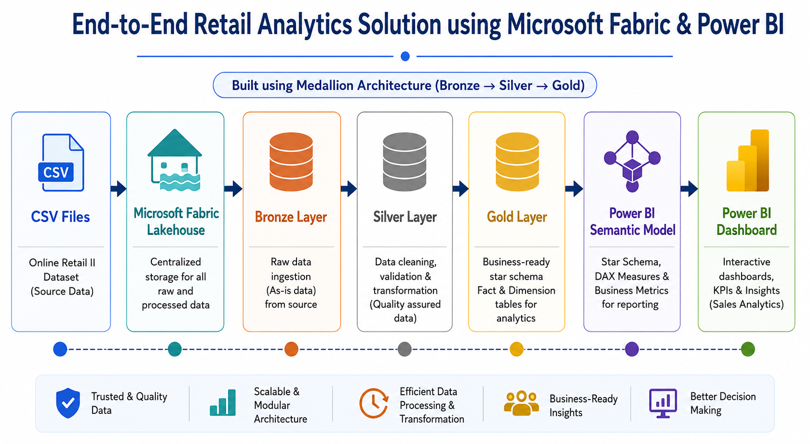
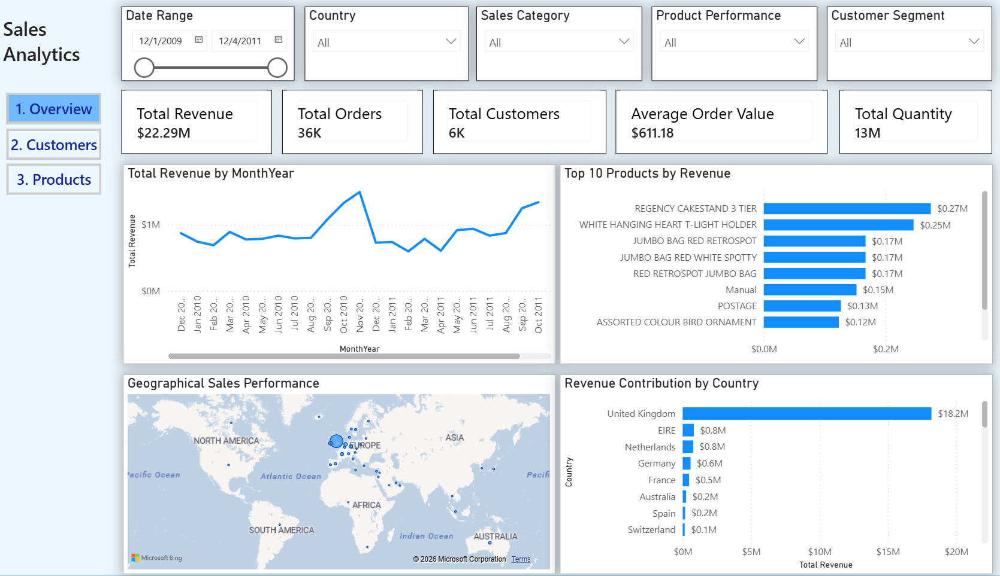
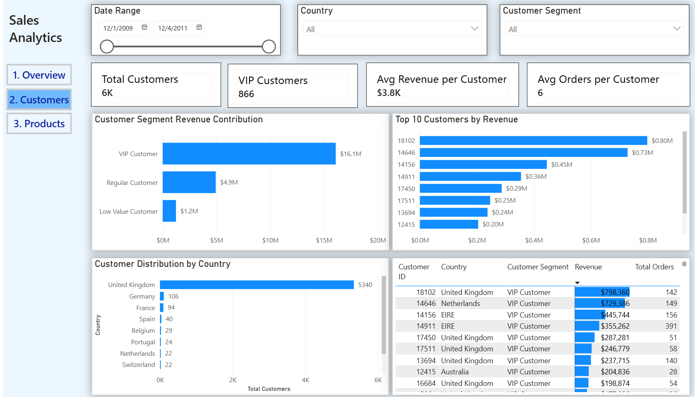
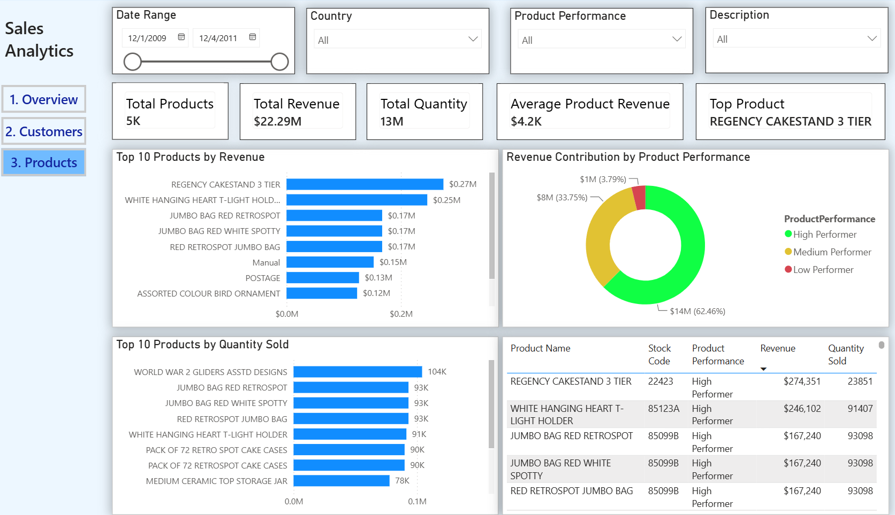

# Retail Sales Analytics using Microsoft Fabric

## Overview

An end-to-end retail analytics solution built using **Microsoft Fabric, PySpark, Delta Lake, and Power BI** following the **Medallion Architecture (Bronze-Silver-Gold)**.

This project demonstrates data ingestion, data transformation, dimensional modelling, semantic modelling, and interactive business intelligence reporting.

---

# Architecture

The project follows a modern data engineering workflow:

---

# Technology Stack

- Microsoft Fabric
- Fabric Lakehouse
- PySpark
- Delta Lake
- SQL
- Power BI
- DAX
- Medallion Architecture

---

# Data Pipeline

## Bronze Layer

Raw data ingestion layer.

Activities:

- Loaded retail transaction CSV files into Microsoft Fabric Lakehouse
- Stored raw data in Delta format
- Maintained original source structure

---

## Silver Layer

Data cleaning and transformation layer.

Transformations:

- Removed invalid records
- Handled missing values
- Data type corrections
- Added Revenue calculation
- Added ingestion timestamp
- Performed data quality checks

---

## Gold Layer

Business-ready analytical layer.

Implemented a Star Schema consisting of:

### Dimension Tables

### dim_customer

Contains:

- CustomerKey
- CustomerID
- Country
- Customer Revenue
- Customer Order Count
- Customer Segment

Customer Segmentation:

- VIP Customer
- Regular Customer
- Low Value Customer

---

### dim_product

Contains:

- ProductKey
- StockCode
- Description
- Product Revenue
- Quantity Sold
- Product Performance

Product Classification:

- High Performer
- Medium Performer
- Low Performer

---

### dim_date

Contains:

- DateKey
- Date
- Year
- Month
- Month Name
- Quarter
- Month Year
- Week Number
- Weekend Flag

---

### Fact Table

### fact_sales

Contains:

- Invoice Number
- Product Key
- Customer Key
- Date Key
- Quantity
- Unit Price
- Revenue
- Sales Category
- Quantity Category
- Return Flag

---

# Data Model

Implemented Star Schema:

             dim_customer
                  |
                  |
dim_date ---- fact_sales ---- dim_product

---

# Power BI Dashboard

Built an interactive retail analytics dashboard with three pages.

---

## Overview Dashboard

Key Metrics:

- Total Revenue
- Total Orders
- Total Customers
- Total Quantity
- Average Order Value

Visuals:

- Revenue Trend Analysis
- Top 10 Products by Revenue
- Revenue Contribution by Country
- Country-wise Sales Analysis

---

## Customer Analytics Dashboard

Key Metrics:

- Total Customers
- VIP Customers
- Average Customer Revenue
- Average Orders per Customer

Visuals:

- Revenue Contribution by Customer Segment
- Top Customers by Revenue
- Customer Distribution by Country
- Customer Detail Analysis

---

## Product Analytics Dashboard

Key Metrics:

- Total Products
- Total Revenue
- Total Quantity Sold
- Average Product Revenue
- Top Product

Visuals:

- Top 10 Products by Revenue
- Product Performance Analysis
- Top Products by Quantity Sold
- Product Details Table

---

# Business Insights

Key insights generated:

- United Kingdom contributes the majority of revenue.
- VIP customers generate the highest revenue contribution.
- A small number of products contribute significantly to overall sales.
- Product performance segmentation identifies high-value products.
- Customer analytics helps understand purchasing behaviour.

---

# Project Workflow

CSV Files

↓

Microsoft Fabric Lakehouse

↓

Bronze Layer

↓

Silver Layer

↓

Gold Layer

↓

Semantic Model

↓

Power BI Dashboard

---

# Future Enhancements

- Add Microsoft Fabric Data Pipeline orchestration
- Automate scheduled refresh
- Add product category classification
- Implement RFM customer segmentation
- Add sales forecasting using Machine Learning

---

# Author

**Riya Mota**

Computer Science (AI & ML) Graduate

Skills:

Python | SQL | Power BI | Microsoft Fabric | PySpark | Data Analytics | Generative AI
